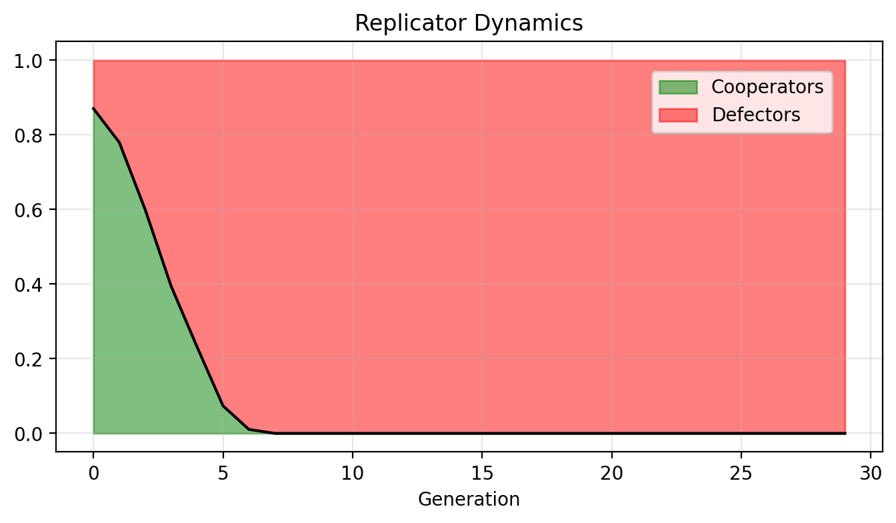
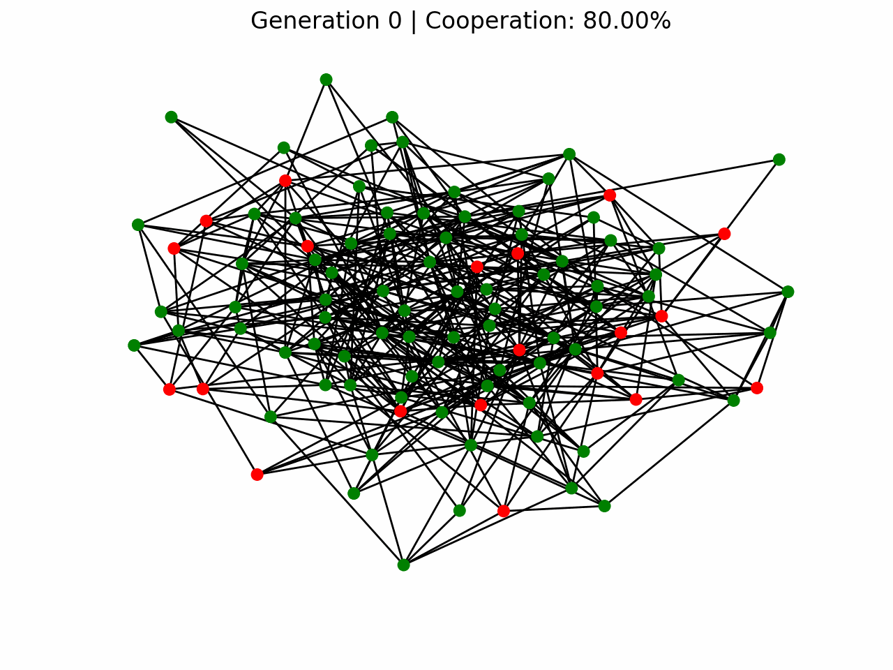
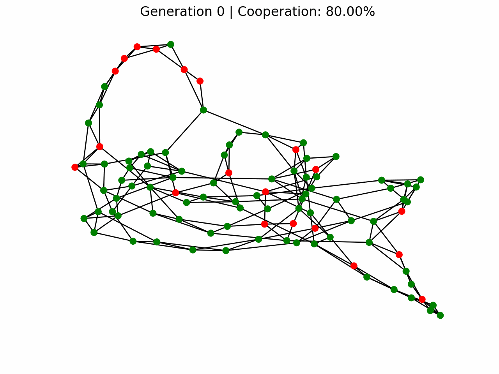
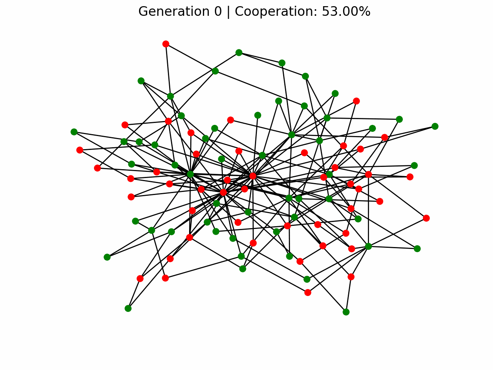
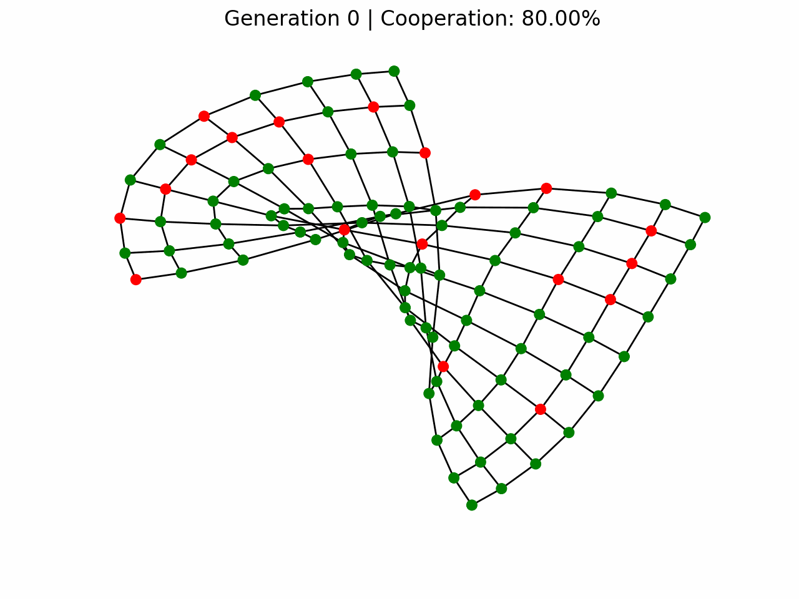

# GameGraph

## Evolutionary Game Theory on Networks

In this project, I explore the consequences of adding network structure to the classic Prisoner's Dilemma. Each agent (a cooperator or a defector) occupies a node in the network. During each generation, agents play the game with their neighbors, and if one of their neighbors achieves a higher payoff, they copy that neighbor's strategy in the next generation.

Who will survive: Cooperators or defectors? 

(see images below)

## Inspiration  
🎥 **[This Game Theory Problem Will Change the Way You See the World](https://youtu.be/mScpHTIi-kM?si=BKYRuzfoD5hlYpjU)**


## Current Features

- Prisoner's Dilemma implementation
- Population payoff computation
- Evolution using Replicator Dynamics
- Erdős–Rényi, Watts–Strogatz, Barabási–Albert, and lattice network generation
- Evolution of cooperation across generations
- Animated strategy evolution on networks
- Strategy proportion plot

## Getting Started

If you want to check it out: 

```bash
git clone https://github.com/joslfer/gamegraph.git
cd gamegraph

python3 -m venv .venv
source .venv/bin/activate

pip install -r requirements.txt

jupyter notebook
```

## Project Structure

```text
gamegraph/
├── cuadernos/
│   ├── 01_prisoner_dilemma.ipynb
│   ├── 02_graphs_intro.ipynb
│   ├── 03_network_implementation.ipynb
│   └── 04_games_on_networks.ipynb
├── images/
│   ├── barabasi_albert.gif
│   ├── erdos_renyi.gif
│   ├── lattice.gif
│   ├── replicatordynamics.png
│   └── watts_strogatz.gif
├── src/
│   └── games/
│       ├── __init__.py
│       └── prisoners_dilemma.py
├── .gitignore
├── LICENSE
├── README.md
└── requirements.txt
```

## Results 

In a well-mixed population the simulation converges to an all-defector population, as predicted by the Nash equilibrium of the Prisoner's Dilemma. 




## Networks
To observe stable cooperation when networks are introduced the reward parameter must be increased. (before: R = 3, after R = 4.5)

### Erdős–Rényi Random Network



### Watts–Strogatz Small-World Network



### Barabási–Albert Network



### Regular Lattice Network




## Conclusion: Finding stable cooperation 

It is still unclear whether network topology affects the stability of cooperator populations. At first, I thought that higher degrees benefited defectors, but I could not find convincing evidence to support this claim. The most important parameter seems to be R, the reward payoff when two cooperators play together. When R = 3, every network collapsed into a population of defectors, and with R = 4.5 cooperators stabilized. 

At least, the network visualizations are really cool. 